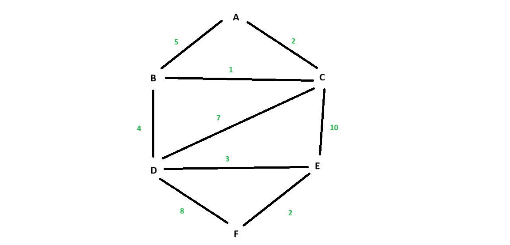
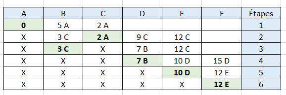
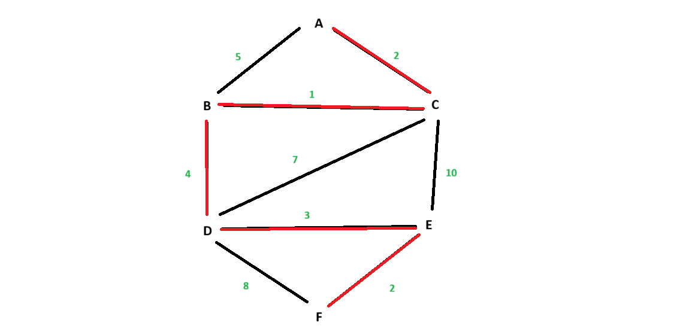

# Équipe 3

## 1. Présentation du projet

### 1.1 Objectif du projet

Cette équipe travaille sur les exercices 3.1 et 3.3 portant sur les arbres et l'algorithme de Dijkstra.

### 1.2 Description du projet

Ce projet consiste à réaliser en équipe trois exercices de révision portant sur les arbres, les graphes et l’algorithme de Dijkstra.

Chaque membre de l’équipe prend en charge un exercice, puis explique sa solution aux autres membres afin que toute l’équipe puisse comprendre et maîtriser les différentes notions.

Les trois exercices de l’équipe 3 sont :

- **3.1** — Arbre binaire : du dessin à la liste - Xuan
- **3.2** — Graphe : du dictionnaire au dessin
- **3.3** — Dijkstra : à partir d’une matrice - Laura

---

## 2. Membres de l'équipe

- Laura Sorro
- Xuan Wang

---

## Répartition du travail

| Membre | Responsabilités |
|---|---|
| Xuan Wang | Partie 3.1 |
| Laura Sorro | Partie 3.3 |

## 3. Réalisation du projet

### 3.1 Xuan  — Arbre binaire : du dessin à la liste

> **Responsable : Xuan**

L'exercice 3.1 consiste à partir d'un arbre binaire représenté sous forme de dessin et à construire sa représentation sous forme de liste Python.

#### 3.1.a Travail réalisé

- Analyse de l’arbre binaire à partir de sa représentation graphique.
- Identification de la position de chaque nœud dans la liste.
- Transformation de l’arbre en une liste Python en respectant la règle des indices :
  - enfant gauche : `2i + 1`
  - enfant droit : `2i + 2`
- Identification des cases `None` nécessaires pour conserver la structure de l’arbre.
- Réalisation du parcours en largeur, niveau par niveau et de gauche à droite.
- Identification des feuilles, des branches et du nombre de niveaux.

| Nœud | J | D | T | A | G | W | E | U  |
| ---- | - | - | - | - | - | - | - | -- |
| Case | 0 | 1 | 2 | 3 | 4 | 6 | 9 | 13 |

#### 3.1.b Développement / Implémentation

La représentation de l’arbre sous forme de liste Python est la suivante :

```python
arbre = [
    "J", "D", "T", "A", "G", None, "W",
    None, None, "E", None, None, None, "U"
]
```

Les cases `None` sont utilisées lorsqu'une position ne contient pas de nœud, afin de respecter la représentation d’un arbre binaire dans une liste.

#### 3.1.c Résultats

- Nombre de cases : 14
- Nombre de `None` : 6
- Parcours en largeur : J → D → T → A → G → W → E → U
- Feuilles : A, E et U
- Nombre de branches : 7
- Nombre de niveaux : 4

Le parcours en largeur correspond à l’ordre des nœuds dans la liste lorsqu’on ignore les valeurs `None`.

---

### 3.3 Laura Sorro — Dijkstra : à partir d’une matrice

> **Responsable : Laura Sorro**

L'exercice 3.3 consiste à trouver le plus court chemin de **A** vers **F** dans un réseau qui n'est pas dessiné : il est donné par sa **matrice pondérée**. Une case vaut le nombre de minutes de la rue, et **0 veut dire : pas de rue**.

#### 3.3.a Travail réalisé

- Lecture de la matrice : elle est **symétrique**, donc le réseau est **non orienté** (une rue se prend dans les deux sens).
- Lecture de la moitié **au-dessus de la diagonale** seulement, puisque l'autre moitié en est la copie : on trouve **9 rues**.
- Dessin du réseau, avec le nombre de minutes sur chaque rue.
- Remplissage du tableau de Dijkstra avec les deux règles de la séance 4 :
  1. **entourer** la plus petite case non barrée de la dernière ligne ;
  2. **barrer** sa colonne, puis **relâcher** chacune de ses rues : on n'écrit que si c'est plus court.
- Lecture du plus court chemin en remontant les lettres, de F jusqu'à A.
- Vérification avec les deux contrôles gratuits de la séance 4.

#### 3.3.b Développement / Implémentation

**a) Le réseau.** Les 9 rues lues dans la matrice :

| Rue | A–B | A–C | B–C | B–D | C–D | C–E | D–E | D–F | E–F |
|---|---|---|---|---|---|---|---|---|---|
| Minutes | 5 | 2 | 1 | 4 | 7 | 10 | 3 | 8 | 2 |



**b) Le tableau de Dijkstra** (en vert : la case entourée à chaque étape) :



Le détail des relâchements :

- **Étape 1** — on entoure A (0). B : 0 + 5 = 5 → 5-A. C : 0 + 2 = 2 → 2-A.
- **Étape 2** — on entoure C (2). B : 2 + 1 = 3, plus petit que 5 → **3-C**. D : 2 + 7 = 9 → 9-C. E : 2 + 10 = 12 → 12-C.
- **Étape 3** — on entoure B (3). D : 3 + 4 = 7, plus petit que 9 → **7-B**.
- **Étape 4** — on entoure D (7). E : 7 + 3 = 10, plus petit que 12 → **10-D**. F : 7 + 8 = 15 → 15-D.
- **Étape 5** — on entoure E (10). F : 10 + 2 = 12, plus petit que 15 → **12-E**.
- **Étape 6** — on entoure F (12) : c'est l'arrivée, le tableau est fini.

#### 3.3.c Résultats

**c) Le plus court chemin**, en rouge sur le dessin :



- **Chemin :** A → C → B → D → E → F
- **Durée :** 2 + 1 + 4 + 3 + 2 = **12 minutes**, le même nombre que la case 12-E.
- **Cases améliorées en cours de route :** B (5 → 3), D (9 → 7), E (12 → 10) et F (15 → 12).
- **Contrôles gratuits :** aucune colonne ne remonte, et les valeurs entourées ne descendent jamais (0, 2, 3, 7, 10, 12).

**d) Pourquoi passer par C pour aller en B ?** Le détour par C coûte 2 + 1 = 3 minutes, moins que les 5 minutes de la rue directe A–B. À l'étape 2, on a donc remplacé 5-A par 3-C : la rue la plus directe n'est pas forcément la plus rapide.

---

## 4. Difficultés rencontrées et solutions

### 4.1 Sur la matière

| Difficulté | Solution |
|---|---|
| **3.1** — Placer les nœuds quand l'arbre a des trous : sans les cases vides, les nœuds suivants se décalent. | Calculer chaque case avec la formule `2i + 1` (gauche) ou `2i + 2` (droite), puis écrire `None` dans chaque case sans nœud. |
| **3.3** — Lire la matrice sans compter chaque rue deux fois. | La matrice est symétrique : on ne lit que la moitié au-dessus de la diagonale. On trouve 9 rues. |
| **3.3** — Accepter qu'une case déjà écrite change : B valait d'abord 5 par la rue directe. | Appliquer la règle du relâchement : on réécrit une case seulement si la nouvelle route est plus courte (3 < 5). Quatre cases ont ainsi été améliorées. |

### 4.2 Sur Git et GitHub

| Difficulté | Solution |
|---|---|
| Dans GitHub Desktop, le bouton **New branch** restait grisé. | Le dépôt était vide : une branche part toujours de `main`, et `main` n'avait encore aucun commit. Un premier commit sur `main` a débloqué la création de la branche `feature/Dijkstra/matrice`. |
| Un fichier de l'exercice 3.3 a été supprimé par erreur dans la branche. | Le travail n'était pas perdu : il restait dans l'historique Git. Le contenu a ensuite été déplacé directement dans ce README, avec les images. |
| La branche locale n'était pas synchronisée avec celle de GitHub, car certains commits avaient été faits directement sur GitHub.com. | Les dernières corrections ont été faites sur GitHub.com, sur la même branche, sans pousser la version locale (pas de *force push*). |
| Le lien vers un fichier ne marchait plus après un changement de nom. | Vérifier que le nom écrit dans le README est exactement celui du fichier : les points, les tirets bas et les majuscules comptent. |

---

## 5. Conclusion

Les deux exercices réalisés montrent deux façons de passer d'une représentation à une autre. En 3.1, on range un arbre dessiné dans une simple liste Python : la formule `2i + 1` / `2i + 2` suffit à retrouver chaque enfant, à condition de garder des `None` à la place des nœuds absents. En 3.3, on part au contraire d'une matrice pour retrouver le réseau, puis Dijkstra y trouve le plus court chemin de A à F : **A → C → B → D → E → F, en 12 minutes**.

Ce qui nous a le plus marqués : le chemin le plus direct n'est pas toujours le plus rapide. La rue A–B coûte 5 minutes, mais le détour par C n'en coûte que 3. Dijkstra le découvre tout seul grâce au relâchement, et les deux contrôles gratuits permettent de vérifier le tableau sans le refaire.

Côté travail d'équipe, chaque partie a été faite dans sa propre branche, puis proposée par une pull request relue par l'autre membre avant la fusion dans `main`. Les problèmes rencontrés avec Git (dépôt vide, fichier supprimé, branche non synchronisée) nous ont appris qu'un commit n'est jamais perdu : il reste dans l'historique, et on peut toujours revenir en arrière.

L'exercice 3.2 (du dictionnaire au dessin) n'a pas été attribué, l'équipe ne comptant que deux membres.

---
